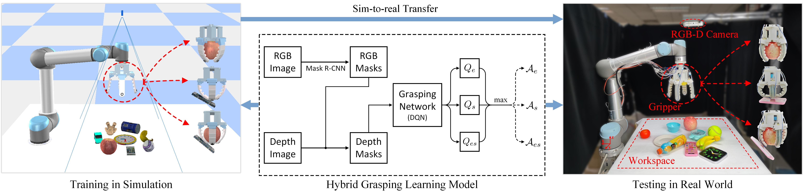

## Hybrid Robotic Grasping with a Soft Multimodal Gripper and a Deep Multistage Learning Scheme

IEEE Transactions on Robotics (TRO) 2023 [[Paper]](https://browse.arxiv.org/pdf/2202.12796.pdf)

[Fukang Liu](https://fukangl.github.io/)<sup>1,2</sup>,[Fuchun Sun](https://scholar.google.com/citations?user=DbviELoAAAAJ&hl=en)<sup>2</sup>,[Bin Fang](https://scholar.google.com/citations?user=5G47IcIAAAAJ&hl=en)<sup>2</sup>,[Xiang Li](https://scholar.google.com/citations?user=6EIX-JQAAAAJ&hl=en)<sup>2</sup>,Songyu Sun<sup>3</sup>,[Huaping Liu](https://scholar.google.com/citations?user=HXnkIkwAAAAJ&hl=en)<sup>2</sup><br/>

<sup>1</sup>Carnegie Mellon University </br> 
<sup>2</sup>Tsinghua University </br>
<sup>3</sup> University of California, Los Angeles </br> 

#### Contact
If you have any questions, please let me know: [Fukang Liu](https://fukangl.github.io/) fukangliu[at]gatech[dot]edu





## Installation

The implementation requires the following dependencies:

* [Python3](https://www.python.org/), [PyTorch 1.0+](https://pytorch.org/), [NumPy](https://numpy.org/), [OpenCV-Python](https://docs.opencv.org/4.x/d6/d00/tutorial_py_root.html), [SciPy](https://scipy.org/), [Matplotlib](https://matplotlib.org/), [CoppeliaSim](https://www.coppeliarobotics.com/)</br> 


## Instructions

1. The soft multimodal gripper was developed based on our previous work, please find more details: ["Multimode Grasping Soft Gripper Achieved by Layer Jamming Structure and Tendon-Driven Mechanism"](https://www.liebertpub.com/doi/10.1089/soro.2020.0065).

1. Checkout this repository and download the [datasets](https://github.com/fukangl/SMG-multimodal-grasping/blob/main/datasets.zip). UnZip it and put the unzipped file to the /code directory.

1. Run CoppeliaSim (navigate to your CoppeliaSim directory and run `./coppeliaSim.sh`). From the main menu, select `File` > `Open scene...`, and open the file `code/simulation/simulation-lc.ttt`(lightly-cluttered) or `simulation-hc.ttt`(highly-cluttered) from this repository. Choose the `Vortex` physics engine for simulation (you can also choose other physics engines that CoppeliaSim supports (e.g., `Bullet`, `ODE`), but `Vortex` works best for the simulation model of SMG).

1. In another terminal window, run the following example:

```shell
python main.py --is_sim --method 'reinforcement' --is_ets --is_pe --is_oo --explore_rate_decay
```


## Training

To train an Reactive Enveloping and Sucking Policy (E+S Reactive) in simulation with lightly cluttered environment, run the following:

```shell
python main.py --is_sim --method 'reactive' --is_pe --is_oo --explore_rate_decay
```


To train an Reactive Enveloping, Sucking and Enveloping_then_Sucking Policy (E+S+ES Reactive) in simulation with lightly cluttered environment, run the following:

```shell
python main.py --is_sim --method 'reactive' --is_ets --is_pe --is_oo --explore_rate_decay
```


To train a DRL Enveloping and Sucking Policy (E+S DRL) in simulation with lightly cluttered environment, run the following:

```shell
python main.py --is_sim --method 'reinforcement' --is_pe --is_oo --explore_rate_decay
```


To train a DRL multimodal grasping policy (E+S+ES DRL(PE+OO)) in simulation with lightly cluttered environment, run the following:

```shell
python main.py --is_sim --method 'reinforcement' --is_ets --is_pe --is_oo --explore_rate_decay
```

Tranining policies in highly cluttered environment, add `--is_cluttered`. For example, For training a DRL multimodal grasping policy (E+S+ES DRL(PE+OO)) in simulation with highly cluttered environment, run the following:

```shell
python main.py --is_sim --is_cluttered --method 'reinforcement' --is_ets --is_pe --is_oo --explore_rate_decay
```


## Evaluation

To test your own pre-trained model, simply change the location of `--snapshot_file`. For example, for testing the pre-trained E+S+ES DRL(PE+OO) model in simulation with lightly cluttered environment, run the following:

```shell
python main.py --is_sim --method 'reinforcement' --is_ets --is_pe --is_oo --explore_rate_decay \
--is_testing \
--load_snapshot --snapshot_file 'YOUR-SNAPSHOT-FILE-HERE'
```

To test the three ablation baselines, remove `--is_pe` or `--is_oo`.
For testing a DRL multimodal grasping policy that executes actions without either preenveloping or orientation optimization (E+S+ES DRL) in simulation with lightly cluttered environment, remove both `--is_pe` and `--is_oo`:

```shell
python main.py --is_sim --method 'reinforcement' --is_ets --explore_rate_decay \
--is_testing \
--load_snapshot --snapshot_file 'YOUR-SNAPSHOT-FILE-HERE'
```


For testing a DRL multimodal grasping policy that executes actions with only preenveloping (E+S+ES DRL(PE)) in simulation with lightly cluttered environment, remove `--is_oo`:

```shell
python main.py --is_sim --method 'reinforcement' --is_ets --is_pe --explore_rate_decay \
--is_testing \
--load_snapshot --snapshot_file 'YOUR-SNAPSHOT-FILE-HERE'
```


To test a DRL multimodal grasping policy that executes actions with only orientation optimization (E+S+ES DRL(OO)) in simulation with lightly cluttered environment, remove `--is_pe`:

```shell
python main.py --is_sim --method 'reinforcement' --is_ets --is_oo --explore_rate_decay \
--is_testing \
--load_snapshot --snapshot_file 'YOUR-SNAPSHOT-FILE-HERE'
```


## Bibtex
If you find the code or gripper design useful, please cite:

```
@article{liu2023hybrid,
    title={Hybrid Robotic Grasping with a Soft Multimodal Gripper and a Deep Multistage Learning Scheme},
    author={Liu, Fukang and Fang, Bin and Sun, Fuchun and 
    Li, Xiang and Sun, Songyu and Liu, Huaping},
    journal={IEEE Transactions on Robotics},
    year={2023},
    publisher={IEEE}
}
```

and

```
@article{fang2022multimode,
  title={Multimode grasping soft gripper achieved by layer jamming structure and tendon-driven mechanism},
  author={Fang, Bin and Sun, Fuchun and Wu, Linyuan and Liu, Fukang and 
  Wang, Xiangxiang and Huang, Haiming and Huang, Wenbing and Liu, Huaping and Wen, Li},
  journal={Soft Robotics},
  volume={9},
  number={2},
  pages={233--249},
  year={2022}
}
```


## Acknowledgements
This code was developed using [visual-pushing-grasping](https://github.com/andyzeng/visual-pushing-grasping).
